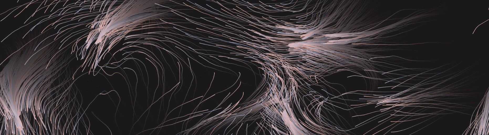
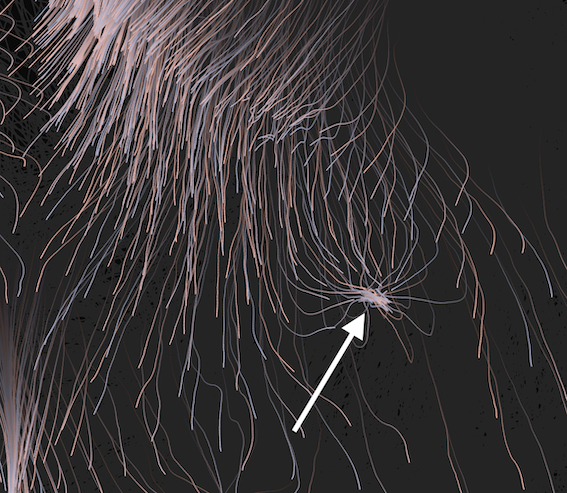
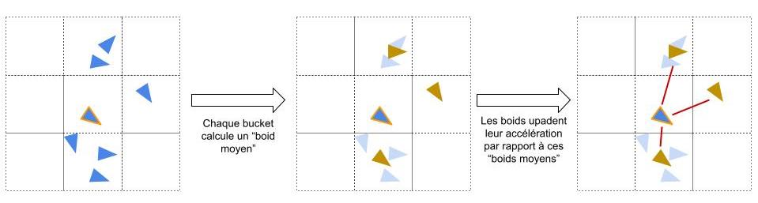

# Web Boids

## Qu'est-ce que c'est 
WebBoids est une petite expérience se basant sur la physique des simulations de nuée telle 
que décrite par [Craig Reynolds](https://www.red3d.com/cwr/boids/). Le code tourne dans un navigateur 
web et utilise la librairie graphique javascript [p5](https://p5js.org/).

## Quelques points techniques
Cette implémentation comporte quelques différences avec l'implémentation classique 
de l'article de Craig Reynolds.

### Sources de nourriture
Si les boids ne suivent que les 3 règles d'alignement, cohésion et séparation la simulation va 
éventuellement atteindre un équilibre pas très intéressant visuellement. Pour ajouter un élément 
aléatoire dans les trajectoires des boids, des sources de nourriture apparaissent aléatoirement
dans la simulation et les boids essayent de s'en approcher pour les manger.

### Optimisation par Bucketing
Afin d'améliorer la recherche des voisins de chaque boid l'espace est bucketisé. De plus, l'algorithme
va pour chaque bucket calculer la position moyenne ainsi que la vélocité moyenne des boids de ce 
bucket (O(n)). Lors de l'update de l'accélération, les boids ne vont pas considérer tous leurs voisins,
mais uniquement les positions et vélocités moyennes des buckets voisins. Grace à ça, l'update 
peut se faire en O(n).

### Ajustement du nombre de boids
La simulation ajuste dynamiquement le nombre de boids afin de garder le framerate autour de 25 fps.

## A quoi ça sert 
c bo